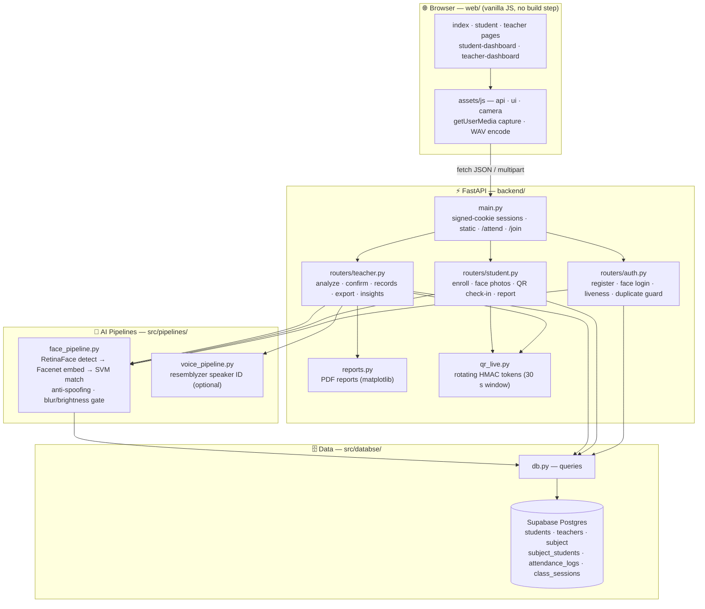
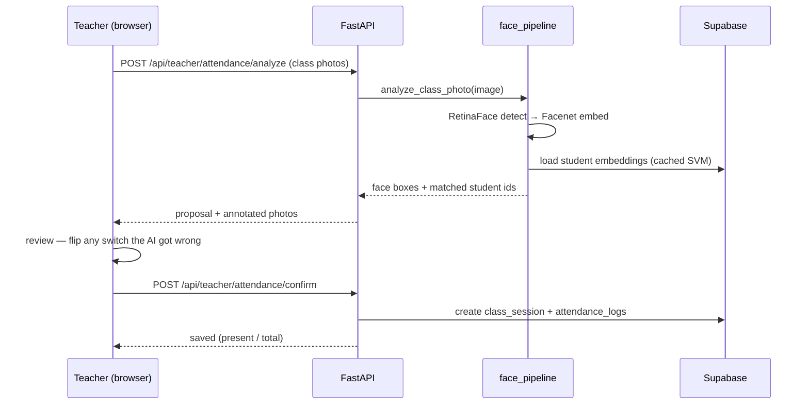
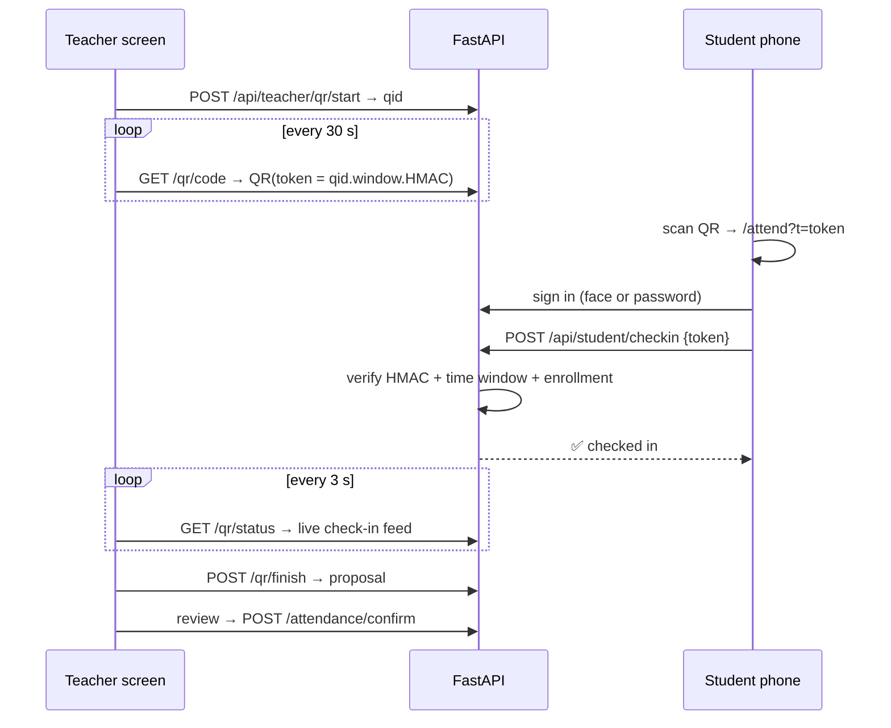

# 📸 SnapClass — Smart Attendance System

AI-powered attendance for classrooms. Teachers photograph the class, record voices, or show a live QR code; SnapClass recognizes enrolled students and marks attendance in seconds. Students enroll with face photos and track their own attendance.

**Stack:** FastAPI + vanilla HTML/CSS/JS (no build tools) · DeepFace (Facenet) + scikit-learn for face recognition · Supabase (Postgres) · matplotlib for PDF reports.

## Features

### Three ways to take attendance
- **📷 Class photos** — upload or capture photos; faces are detected, matched, and shown with name-tagged boxes for review.
- **🎤 Voice** — students say "I am present"; speaker recognition marks them (optional, needs `resemblyzer` + `librosa`).
- **🔳 Live QR check-in** — a QR code on the teacher's screen rotates every 30 s (HMAC-signed, so screenshots go stale); students scan and check in from their phones.

Every mode ends in a **review screen**: the teacher flips switches the AI got wrong before anything is saved.

### Students
- **Face login** with anti-spoofing (photo-of-a-screen rejection) and a password fallback.
- **Multi-photo enrollment** — more angles, better recognition; a strength meter shows progress.
- **Photo quality gate** — blurry or dark photos are rejected with the reason instead of poisoning the profile.
- **Test recognition** — check the AI knows you before it matters.
- Join subjects by code, link, or QR; per-subject attendance bars; **PDF report** (week/month).

### Teachers
- Subjects with shareable join codes + QR.
- Records by session with date filter, **CSV export**, **PDF reports** with charts.
- Analytics: per-class trend, per-student rates, below-75 % alerts, and **smart insights** (absence streaks, sharp declines, weekday patterns).
- Duplicate-face guard at registration — one face, one account.

## Architecture Overview

### System Architecture



### Photo Attendance Lifecycle (key flow)



### Live QR Check-in (anti-proxy flow)



## Setup

```bash
python -m venv .venv
.venv\Scripts\activate          # Windows · source .venv/bin/activate on Linux/macOS
pip install -r requirements.txt
```

### Configure Supabase
Create `.streamlit/secrets.toml` (or set env vars — see `.env.example`):

```toml
SUPABASE_URL = "https://YOUR-PROJECT.supabase.co"
SUPABASE_KEY = "YOUR-KEY"
```

Expected tables: `teachers`, `students`, `subject`, `subject_students`, `attendance_logs`.
Then run [`migrations.sql`](migrations.sql) once in the Supabase SQL Editor (adds multi-embedding support and class sessions).

### Run

```bash
python -m uvicorn backend.main:app --port 8000
```

Open **http://localhost:8000**. First face operation downloads the Facenet/RetinaFace weights (one-time).

> Camera capture requires a secure context: `localhost` works out of the box; phones on your LAN need HTTPS (the password login and QR check-in work regardless).

## Project structure

```
backend/            FastAPI app
  main.py           routes, sessions, static serving
  routers/          auth · student · teacher APIs
  reports.py        PDF report rendering (matplotlib)
  qr_live.py        live QR sessions (rotating HMAC tokens)
src/
  pipelines/        face & voice recognition (DeepFace, SVM, resemblyzer)
  databse/          Supabase client + queries
web/                frontend (plain HTML/CSS/JS, no build step)
  assets/css/       design system (tokens + components)
  assets/js/        api · ui · camera helpers + page scripts
migrations.sql      one-time Supabase schema additions
```

## Deploy (Hugging Face Spaces)

The repo ships with a [Dockerfile](Dockerfile) ready for a free Docker Space (model weights are baked into the image for fast cold starts):

1. Create a **Space** → SDK **Docker** (blank template).
2. In Space **Settings → Variables and secrets**, add secrets: `SUPABASE_URL`, `SUPABASE_KEY`, `SESSION_SECRET` (any long random string).
3. Push this repo to the Space and open the **direct URL** `https://<user>-<space>.hf.space` (use the direct URL, not the iframed Space page, so login cookies work).

## License

MIT — see [LICENSE](LICENSE).
